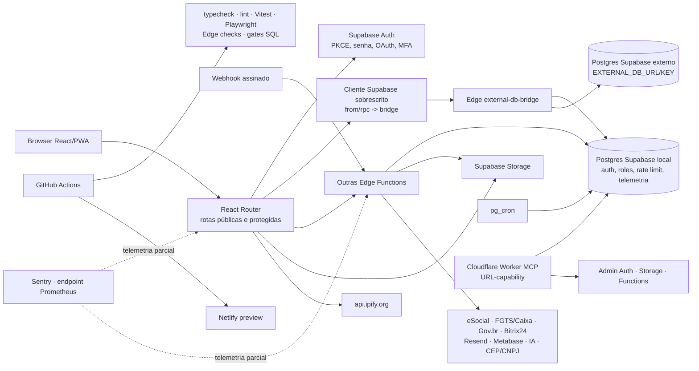

# Auditoria total — Departamento Pessoal V3

Data da coleta: 30/08/2026 · commit auditado: `8e86a1ebd9269a2b0a4d261bb3723f6a745cf3ca`

## 1. Estado geral

1. Plataforma multiempresa de Departamento Pessoal em React/Vite, Supabase e um bridge para banco externo.
2. O clone local e a `main` remota estavam no mesmo commit; as únicas alterações da auditoria são este relatório e o plano correspondente.
3. Produção usa PostgreSQL 17.6, 360 tabelas `public`, 43 views e aproximadamente 40 MB.
4. Risco máximo: o MCP de produção aceita sua URL-capability sem uma segunda autenticação e oferece administração completa.
5. Risco máximo: views e funções `SECURITY DEFINER` dão caminhos reais para leitura/alteração cross-tenant fora do RLS.
6. Risco máximo: policies universais e de mera associação ao tenant anulam controle por papel em dados pessoais, bancários e de folha.
7. O bridge perde a identidade do usuário em SELECT/DML; seu modelo de autorização diverge do RLS que afirma preservar.
8. Cinco fluxos críticos têm quebra confirmada: colaborador, ponto, fechamento de folha, obrigações legais e Storage.
9. Os workflows do commit atual estão vermelhos; gates de banco aparecem verdes sem consultar banco algum.
10. Não há backup agendado nem bucket em produção; observabilidade do bridge está sem eventos há 39 dias.

### Contexto validado

- Sistema: Departamento Pessoal V3 — colaboradores, folha, ponto, férias, documentos, SST e obrigações trabalhistas em múltiplas empresas.
- Stack instalada no lockfile: React 19.2.8, Vite 8.2.1, TypeScript 7.0.2, Vitest 4.1.11, Supabase/Postgres e Edge Functions Deno.
- Repositórios: clone local e `https://github.com/adm01-debug/Departamento_Pessoal_V3`.
- Acessos: código ✓ · banco de produção via MCP ✓ · GitHub Actions ✓ · inventário de deploy das Edge Functions ✗ · logs de runtime/Netlify/Sentry ✗ · banco externo do bridge ✗.
- Restrições: somente leitura; apenas `AUDITORIA.md` e `PLANO_100.md` podem ser escritos; nenhuma exploração destrutiva; PII e segredos mascarados.
- Orçamento: sem teto declarado.
- Sintomas fornecidos: nenhum; os sintomas documentados abaixo foram observados no código, banco ou pipelines.
- Fluxos rastreados ponta a ponta: login/MFA, colaborador, cálculo/fechamento da folha, registro/processamento de ponto e férias/documentos.

## 2. Mapa de conexões



Portas verificadas: `src/App.tsx:177-194`; `src/integrations/supabase/client.ts:9-31,55-90,93-225`; `supabase/functions/external-db-bridge/index.ts:335-788`; `supabase/functions/webhook/index.ts:67-190`; `cron.job`; `.github/workflows/*.yml`.

## 3. Achados

### Segurança administrativa

#### A-001 · [P0] · infra/segurança — URL-capability do MCP concede administração irrestrita da produção
Evidência: `POST https://supabase-deptpessoal-gw.adm01.workers.dev/***/mcp` com JSON-RPC `initialize`, sem `Authorization`, cookie, mTLS ou Cloudflare Access, respondeu 200 como `supabase-full-mcp-server`; `tools/list` expôs SQL/DML/DDL arbitrário, alteração/exclusão de usuários e operações destrutivas de Storage. `dp_environments` identificou o ref mascarado `frjb…mqbl` como produção e `dp_mcp_config` informou `auth_status=PRONTO_PARA_ATIVAR`, `cf_access_status=DOCUMENTADO`.
Impacto: quem obtiver a URL completa pode ler, alterar ou apagar dados trabalhistas e identidades de produção.
Como explorar: chamar `tools/call` nessa URL e selecionar `supabase_db_query` ou `supabase_auth_update_user`, sem apresentar segunda credencial.
Causa raiz: um segredo no path é a única barreira; autenticação forte e autorização de menor privilégio estão apenas documentadas.

### Banco de dados e Storage

#### A-002 · [P0] · banco/segurança — 42 views de proprietário `postgres` ignoram RLS e são legíveis por `anon`
Evidência: query em `pg_class`/`pg_namespace` retornou 43 views `public`, todas com `SELECT` para `anon`; só `v_system_health` tem `security_invoker=true`. `vw_colaboradores_completo` expõe CPF/e-mail de 12 linhas e filtra apenas `status='ativo'`; `v_audit_trail` expõe e-mail, IP e JSON anterior/novo em 281 linhas.
Impacto: dados pessoais e trilhas de auditoria de todas as empresas são consultáveis sem login.
Como explorar: usar a chave pública do frontend para selecionar CPF, e-mail e `empresa_id` da view `vw_colaboradores_completo` via PostgREST.
Causa raiz: as views executam como o proprietário, receberam grant global e não possuem predicado tenant próprio.

#### A-003 · [P0] · banco/segurança — policies `USING (true)` anulam isolamento em cinco tabelas sensíveis
Evidência: `pg_policies` retornou `USING (true)` para `audit_log`, `cnab_configuracoes`, `historico_rescisoes`, `integracao_logs` e `notificacoes_admissao`, todas acessíveis a `authenticated`. Policies permissivas são combinadas com OR. `audit_log` tem 281 linhas de auditoria/PII e `cnab_configuracoes` uma configuração bancária.
Impacto: usuário comum de uma empresa lê auditoria e dados bancários de outra; as três tabelas hoje vazias ficam expostas quando receberem dados.
Como explorar: autenticar como usuário comum e consultar `audit_log` ou `cnab_configuracoes` sem filtro de empresa.
Causa raiz: migrations posteriores adicionaram policies corretas sem remover todos os nomes legados permissivos.

#### A-004 · [P2] · banco/segurança — 18 funções `SECURITY DEFINER` não fixam `search_path`
Evidência: query em `pg_proc` encontrou 18 funções `public` com `prosecdef=true`, sem `proconfig/search_path`; incluem `dp_decrypt_pii`, `dp_run_retention`, `dp_require_role` e `user_empresa_id`. Dezessete não têm grant público, mas `user_empresa_id()` é executável por `authenticated`.
Impacto: mudanças futuras de grants/schema podem permitir shadowing de objetos sob privilégios do dono; hoje a superfície direta concentra-se em `user_empresa_id()` e chamadas internas.
Causa raiz: criação sem `SET search_path = pg_catalog, public` ou lista mínima equivalente.

#### A-005 · [P1] · banco/storage — produção tem zero buckets e zero policies de objetos
Evidência: `storage.buckets` e `pg_policies` de `storage.objects` retornaram zero linhas. O repositório cria `ferias-avisos` em `supabase/migrations/20260723113000_create_ferias_avisos_bucket.sql:7-9` e faz uploads em `useGerarComunicadoColetivas.ts:19`, `despesaService.ts:86`, `DocumentosPage.tsx:112`, `PerfilPage.tsx:138` e `PontoClockRegister.tsx:153`.
Impacto: avisos de férias, documentos, comprovantes, avatar, biometria e PDFs SST falham em runtime.
Causa raiz: produção divergiu das migrations; nem sequer existe `supabase_migrations.schema_migrations` para provar aplicação.

#### A-008 · [P0] · banco/segurança — 109 funções `SECURITY DEFINER` expostas incluem mutações e PII sem autorização
Evidência: query real em `pg_proc` encontrou 109 funções definer executáveis por `anon` ou `authenticated`. `anonimizar_dados_pessoais(uuid)`, `registrar_batida_ponto(...)`, `fn_link_gov_br_account(uuid,text,text)`, `gerar_rubricas_ferias(uuid)`, `garantir_rubrica_suspensao(uuid)` e `gerar_canonical_espelho_ponto(uuid,text)` aceitam IDs do chamador, não usam `auth.uid()` e executam UPDATE/INSERT ou retornam CPF/PIS/ponto sob privilégios do dono. `cleanup_ciencia_rate_limits()` é executável por `anon`; `get_user_empresas(uuid)` e `is_admin(uuid)` permitem enumeração anônima.
Impacto: um autenticado pode anonimizar outro colaborador, registrar ponto, vincular Gov.br, gerar rubricas ou obter espelho/PII cross-tenant; anônimo pode manipular/consultar metadados de segurança.
Como explorar: chamar `/rest/v1/rpc/anonimizar_dados_pessoais` com o UUID de outro tenant usando qualquer JWT autenticado; o corpo atual não compara o alvo com `auth.uid()`/empresa/papel.
Causa raiz: grants abrangentes sobre funções definer e confiança em IDs fornecidos pelo cliente.

#### A-009 · [P1] · banco/segurança — associação ao tenant basta para escrever folha, banco, férias, ponto e colaboradores
Evidência: `pg_policies` retornou `FOR ALL/UPDATE/DELETE` baseado apenas em `empresa_id IN get_user_empresas(auth.uid())` ou `get_auth_empresa_id()` para `contas_bancarias`, `colaboradores`, `ferias`, `folha_itens`, `folhas_pagamento` e `registros_ponto`. A policy de folha que exige `admin/gestor/rh` é anulada por policies permissivas tenant-only.
Impacto: estagiário ou usuário operacional vinculado à empresa pode alterar/excluir conta bancária, empregado, férias, ponto e folha sem papel funcional.
Como explorar: autenticar como qualquer usuário associado à empresa e executar UPDATE direto em `contas_bancarias` ou DELETE em `colaboradores`; uma policy permissiva tenant-only autoriza.
Causa raiz: isolamento horizontal foi confundido com autorização de ação e policies sobrepostas usam OR.

#### A-025 · [P1] · banco/dados — CPF e matrícula são únicos globalmente, não por empresa
Evidência: `pg_get_indexdef` em produção retornou `colaboradores_cpf_key UNIQUE(cpf)` e `colaboradores_matricula_key UNIQUE(matricula)`, enquanto a entidade contém `empresa_id`; não existe unique composto correspondente.
Impacto: a mesma pessoa não pode ter vínculos legítimos em duas empresas e matrículas comuns como `001` colidem entre tenants.
Causa raiz: constraints nasceram antes/fora do modelo multiempresa e não foram expandidas para `(empresa_id, campo)`.

### Backend, API e autenticação

#### A-006 · [P0] · backend/segurança — bridge não encaminha identidade em SELECT/DML e limita tenant scope a 21 tabelas
Evidência: `external-db-bridge/index.ts:354-374` valida JWT local, mas `:533-542` cria `externalClient` apenas com `EXTERNAL_DB_KEY`; SELECT/INSERT/UPDATE/DELETE usam esse cliente em `:627-735`. Só RPC usa `externalUserClient` com JWT em `:768`. Leitura anônima é intencional (`:1-8`) e `TENANT_SCOPED_TABLES` contém apenas 21 nomes (`validation.ts:83-91`) diante de 360 tabelas públicas observadas.
Impacto: com chave privilegiada, RLS é ignorado e tabelas fora da lista aceitam acesso cross-tenant; com chave pública, operações legítimas falham por ausência da identidade real.
Como explorar: enviar write autenticado para uma tabela sensível ausente da lista, com `empresa_id` de outro tenant; o bridge não chama `assertTenantScope` e usa a chave estática.
Causa raiz: autenticação local e conexão externa foram desacopladas, reutilizando uma credencial estática e uma allowlist incompleta.

#### A-007 · [P1] · backend/dados — cada retry de escrita recebe nova chave de idempotência
Evidência: `src/integrations/supabase/client.ts:60-69` recria headers e executa `crypto.randomUUID()` dentro do laço; `:76-86` repete 429/502/503/504 até três vezes.
Impacto: resposta perdida após commit faz a tentativa seguinte parecer operação nova e pode duplicar lançamentos ou cadastros.
Causa raiz: a chave foi declarada/injetada no escopo da tentativa, não da operação lógica.

#### A-014 · [P1] · autenticação/segurança — lockout customizado pode ser contornado pelo endpoint público do Supabase Auth
Evidência: `AuthContext.tsx:157-178` força apenas a UI a usar `auth-login`; `auth-login/index.ts:109-120` chama o mesmo `signInWithPassword` público com a chave publishable. O endpoint nativo `/auth/v1/token` continua exposto por desenho e não consulta `check_account_lockout`; além disso, falha dessa RPC é aceita fail-open em `:84-92`.
Impacto: credential stuffing direto evita os limites por IP/e-mail e a trilha customizada, restando apenas os limites nativos do GoTrue.
Como explorar: chamar `/auth/v1/token?grant_type=password` com a chave pública do bundle, sem passar pela Edge Function `auth-login`.
Causa raiz: uma política de segurança foi implementada em proxy opcional, sem enforcement no provedor de identidade.

#### A-015 · [P1] · backend/segurança — helper versionado contém chave hardcoded e endpoint de exfiltração de credenciais
Evidência: `supabase/functions/migrate-helper/index.ts:5` contém `ACCESS_KEY` real hardcoded (valor omitido); `:24-29` devolve `SUPABASE_SERVICE_ROLE_KEY` e `SUPABASE_DB_URL`; `supabase/config.toml:7-8` desliga JWT. Gitleaks confirmou `generic-api-key`. GET seguro ao endpoint de produção retornou 404, portanto não foi provado deploy ativo.
Impacto: qualquer deploy acidental do helper entrega acesso service-role e conexão completa a quem lê o repositório/histórico.
Como explorar: se a função for publicada, enviar `x-access-key` igual ao valor versionado e `?action=credentials`.
Causa raiz: ferramenta temporária reintroduzida na `main`, com segredo e retorno de credenciais dentro do código.

### Frontend, UX e fluxos críticos

#### A-010 · [P1] · ponto — caminho online chama RPC que o bridge bloqueia
Evidência: `pontoService.ts:101-121` chama `registrar_batida_ponto`; a RPC não aparece em `RPC_ALLOWLIST` (`validation.ts:95-122`) e `external-db-bridge/index.ts:755-762` responde `RPC_DENIED` para qualquer nome ausente.
Impacto: o registro online de ponto falha antes de chegar à função atômica do banco.
Causa raiz: contrato cliente↔gateway não foi atualizado junto com a RPC.

#### A-011 · [P1] · ponto/segurança — quiosque público simula biometria e grava geolocalização fixa
Evidência: rota pública em `App.tsx:180`; `PontoKioskPage.tsx:65-82` usa matrícula como PIN e confirma “identificação facial” após 3,5 s sem capturar/validar imagem; `:94-98` fixa coordenadas de São Paulo e dispositivo `KIOSK-01`.
Impacto: conhecimento da matrícula basta para bater ponto por terceiro; registros carregam evidência geográfica falsa.
Como explorar: abrir `/ponto/kiosk`, informar a matrícula de outra pessoa e aguardar o timer; nenhuma prova facial é verificada.
Causa raiz: uma animação demonstrativa foi ligada ao fluxo transacional real.

#### A-012 · [P1] · colaboradores — formulário omite `empresa_id` e viola o contrato do service
Evidência: schema em `ColaboradorFormPage.tsx:31-75` não contém `empresa_id`; busca/mutação em `:92-124` chamam `buscarPorId`, `criar` e `atualizar` sem empresa. `BaseService` exige empresa por padrão (`baseService.ts:31-33`) e lança no update sem ela (`:127-131`); a busca por ID só filtra empresa quando recebida (`:97-103`).
Impacto: criação/edição falha; lookup de edição perde o filtro tenant e se soma ao defeito do bridge.
Causa raiz: a tela contorna o hook multiempresa e mascara o erro de tipos com `as any`.

#### A-013 · [P1] · folha/UX — botão “Encerrar” contorna validações, lock otimista e confirmação
Evidência: `FolhaPagamentoPage.tsx:157-177,218-227` faz UPDATE direto para `fechada` sem confirmação. O caminho canônico em `folhaPagamentoService.ts:139-195` bloqueia alertas críticos, valida status/version e chama `fechar-folha` com auditoria/hashes, mas não é usado pela tela.
Impacto: folha pode ser encerrada com inconsistências, por clique acidental ou corrida concorrente, sem a garantia contábil implementada.
Causa raiz: duplicação da operação na page bypassou o service autoritativo.

#### A-026 · [P2] · frontend/UX — dashboards exibem métricas operacionais fictícias como reais
Evidência: `OnboardingDashboard.tsx:21-27` define “Time to hire (mocked for demo)” com Jan–Abr fixos; `FGTSDigitalDashboard.tsx:57-99` fixa status pago, vencimento, R$ 12.450,80, “100% Sincronizado” e “API Caixa Ativa”.
Impacto: RH/gestor toma decisão e presume conformidade fiscal com números que não vêm do banco ou da Caixa.
Causa raiz: conteúdo de demonstração permaneceu em componentes de produção sem rótulo ou feature flag.

#### A-027 · [P2] · privacidade — assinatura de contrato envia IP do titular a terceiro sem timeout/aviso
Evidência: `AssinarContratoPage.tsx:115-129` e `VerificarContratoPage.tsx:41-52` chamam `https://api.ipify.org` no browser antes da RPC, sem `AbortSignal.timeout`; o IP é incluído no ato de assinatura/verificação e a política/consentimento não aparece nesse fluxo.
Impacto: dado de rede do titular é compartilhado com terceiro e indisponibilidade pode atrasar indefinidamente uma assinatura, embora o catch seja best-effort.
Causa raiz: coleta de evidência foi delegada ao browser/terceiro, fora do backend e do inventário de privacidade.

### Integrações externas

#### A-016 · [P1] · integrações legais — UI afirma eSocial/FGTS ativos, mas não há transmissão real
Evidência: `enviar-esocial/index.ts:159-177` simula sucesso se `ESOCIAL_SIMULATE=true` e, fora disso, sempre grava erro 503 “Integração não configurada”; `fgts-digital/index.ts:126-180` e `dctfweb/index.ts:128-169` apenas inserem linhas/protocolos locais. Mesmo assim, `LoginPage.tsx:21-25` anuncia “eSocial 100% Integrado”, `IntegracoesPage.tsx:27-31` marca eSocial ativo e `FGTSDigitalDashboard.tsx:26,41` informa sincronização com API Caixa ativa.
Impacto: obrigação pode parecer transmitida/conforme sem ter alcançado Governo/Caixa, com risco de prazo e multa.
Causa raiz: stubs locais foram apresentados como conectores produtivos.

#### A-017 · [P1] · Bitrix24 — sincronização usa conflitos sem constraints e reporta sucesso mesmo com erro
Evidência: `sincronizar-bitrix/index.ts:105-149` faz upsert de departamentos `onConflict:'nome'` e colaboradores `onConflict:'email'`; produção só tem PK em `departamentos` e nenhuma unique de e-mail em `colaboradores`. O loop converte cada falha em contador e `:180-183` ainda responde `success:true`; a UI mostra toast de conclusão em `ConfigPanels.tsx:71-75`.
Impacto: sincronização não persiste departamentos/colaboradores e pode ser apresentada como concluída.
Causa raiz: contrato de upsert não foi alinhado aos índices reais e erro parcial não determina o status HTTP/resultado.

#### A-031 · [P1] · integrações/segurança — URL configurável do Bitrix permite SSRF a partir da Edge Function
Evidência: admin grava `webhook_url` livre em `ConfigPanels.tsx:35-59,87-99`; `sincronizar-bitrix/index.ts:74-84,107-133` concatena paths e chama essa URL com service-role. `_shared/safe-fetch.ts:72-116` limita tempo, mas não restringe protocolo, host, DNS ou IP privado.
Impacto: conta admin comprometida pode sondar serviços internos/metadata a partir da rede do runtime.
Como explorar: salvar `webhook_url` apontando para host interno/controlado e disparar “Sync Agora”; a Edge Function faz o GET server-side.
Causa raiz: validação de URL foi confundida com timeout; não há allowlist de domínio nem bloqueio de rede privada.

#### A-032 · [P2] · webhook — eventos válidos são marcados `processed` sem executar efeito de negócio
Evidência: após HMAC, timestamp e idempotência corretos, `webhook/index.ts:169-183` chama `processWebhookV1/V2`; ambas as implementações em `:195-203` apenas escrevem `console.log` e retornam um objeto, após o qual o log recebe status `processed`.
Impacto: produtor recebe HTTP 200 e o operador vê “processed”, embora nenhuma entidade de negócio seja alterada.
Causa raiz: handlers placeholder foram conectados ao acknowledgement definitivo.

### Infraestrutura, deploy, backup e observabilidade

#### A-018 · [P1] · backup — não há agendamento real e o “backup” é parcial
Evidência: produção tem seis jobs em `cron.job`, nenhum de backup; `backup-automatico/index.ts:124-137` limita cada tabela a 10.000 linhas e pula erros, e depende do bucket inexistente `backups` em `:159-193`. O outro endpoint `backup/index.ts:79-109` nem exporta dados: faz SELECT e devolve apenas contagens. Não foi encontrada rotina de restore/teste.
Impacto: RPO/RTO declarados não são atendidos e não há artefato restaurável comprovado após perda/corrupção.
Causa raiz: endpoints manuais/parciais foram tratados como estratégia de backup sem scheduler, bucket ou restore drill.

#### A-019 · [P2] · observabilidade — métricas do bridge estão stale e calculadas incorretamente
Evidência: `query_telemetry` tem 265 eventos, 171 erros e último evento em `2026-07-22T17:16:03.957Z`, 39 dias antes da auditoria. `metrics/index.ts:52-75` marca bridge OK se a Promise foi fulfilled mesmo quando a resposta contém erro; `:169-177` calcula “error_rate” dividindo número de erros por latência p95. O healthcheck consulta tabela local opcional, não o bridge externo (`healthcheck/index.ts:42-69`).
Impacto: dashboards/alertas podem indicar saúde enquanto o bridge não emite telemetria ou está indisponível.
Causa raiz: probes medem objetos indiretos e uma fórmula dimensionalmente inválida; não há freshness SLO.

#### A-020 · [P1] · CI — lint do commit atual aborta por TypeScript 7 incompatível
Evidência: run `33257013056`, job Lint, registrou “typescript-eslint does not support TS 7.0” e exit 2. `package.json:135-136` fixa TypeScript 7.0.2 e typescript-eslint 8.67.0; o lockfile declara peer `<6.1.0`.
Impacto: todo push/PR fica vermelho e nenhuma regra de lint chega a executar.
Causa raiz: TypeScript foi atualizado além do peer suportado, contrariando a própria nota de auditoria do repositório.

#### A-021 · [P1] · CI/deploy — E2E e preview usam variável removida e não têm secrets
Evidência: `client.ts:11-23` exige `VITE_SUPABASE_PUBLISHABLE_KEY`; `e2e.yml:18-27` e `deploy.yml:42-44` fornecem `VITE_SUPABASE_ANON_KEY`. `gh secret list`, variables e environments retornaram zero. Run E2E `33257013047`: 23 falhas, 4 skips e URL/key vazias; o preview usa o mesmo contrato incorreto.
Impacto: E2E não testa o app funcional e builds de preview falham no guard de ambiente.
Causa raiz: renome da chave não foi propagado aos workflows e os prerequisites do repositório nunca foram provisionados.

#### A-022 · [P1] · CI/banco — sete gates SQL passam verdes sem acessar o banco
Evidência: `ci.yml:95-164` depende de `SUPABASE_DB_URL`, secret ausente. No run `33257013056`, os scripts imprimiram “Banco indisponível — verificação ignorada”; `audit-rls-tenant-open` ainda tentou socket local e `audit-embed-hints` informou 17 dicas não verificadas, mas o job concluiu success. As falhas A-002/A-003/A-008/A-009 são justamente classes que esses gates prometem bloquear.
Impacto: o check “Integridade do banco” fornece confiança falsa e deixa regressões críticas chegarem à main.
Causa raiz: scripts adotam exit 0 quando a credencial/pré-condição obrigatória falta.

#### A-023 · [P2] · segurança de dependências — audit é ignorado e CodeQL não publica resultados
Evidência: `security.yml:35-39` usa `npm install || true` e `npm audit --audit-level=high || true`. Run `33282990757` encontrou quatro vulnerabilidades (duas high, duas moderate: `brace-expansion`, `fast-uri`, `uuid`) e terminou com “Code scanning is not enabled”, sem upload SARIF.
Impacto: vulnerabilidades conhecidas não bloqueiam entrega nem ficam disponíveis como findings rastreáveis.
Causa raiz: falhas foram suprimidas no shell e a feature necessária do repositório não foi habilitada.

#### A-024 · [P1] · governança/segurança — `main` não tem proteção apesar de checks vermelhos
Evidência: API GitHub `branches/main/protection` respondeu 404 “Branch not protected”. Os runs atuais CI, E2E e Security falham; o workflow de proteção existente é somente manual.
Impacto: push direto ou merge sem review/check pode publicar código vulnerável e contornar todos os controles declarados.
Como explorar: usuário com permissão de escrita envia commit diretamente à `main`; GitHub não exige revisão, status check nem assinatura.
Causa raiz: controle foi codificado como workflow opcional, mas não aplicado nas configurações do branch.

#### A-028 · [P2] · infraestrutura/segurança — Nginx não envia headers de endurecimento
Evidência: `nginx.conf:1-18` configura apenas SPA e proxy `/api`; não há CSP, HSTS, `X-Content-Type-Options`, `Referrer-Policy`, `Permissions-Policy` ou frame policy. O Dockerfile serve esse arquivo em produção (`Dockerfile:8-12`).
Impacto: XSS/dependência comprometida e embedding indevido têm menos contenção no navegador.
Causa raiz: configuração de servidor permaneceu mínima, sem baseline HTTP de segurança.

#### A-029 · [P2] · configuração — contrato de ambiente está incompleto e divergente
Evidência: varredura encontrou 14 variáveis `VITE_*` customizadas no frontend, enquanto `.env.example:1-15` documenta Supabase e Sentry, mas omite Metabase, VAPID e functions base. Para Edge Functions, referências como `EXTERNAL_DB_KEY`, `ESOCIAL_SIMULATE`, `WEBHOOK_SECRET`, `CRON_SECRET` e `ENCRYPTION_MASTER_KEY` não têm manifesto versionado de nomes/obrigatoriedade. O erro A-021 materializa essa divergência.
Impacto: ambientes sobem com features quebradas ou em modo diferente do esperado, sem validação central.
Causa raiz: cada módulo lê env diretamente e não existe schema único por frontend/Edge/deploy.

#### A-030 · [P3] · build — instalações não são reprodutíveis em Docker e preview
Evidência: `Dockerfile:3-6` copia apenas `package.json` e executa `npm install`; `deploy.yml:27-33` usa `bun install` sem `--frozen-lockfile` ou `npm install` sem lock npm. O repositório mantém `bun.lock`.
Impacto: duas builds do mesmo commit podem resolver versões transitivas diferentes e produzir resultados/audits diferentes.
Causa raiz: lockfile não participa de todos os caminhos de instalação.

### Qualidade e manutenção

#### A-033 · [P3] · tipos — contratos de produção ainda contêm 1.132 ocorrências de `any`
Evidência: `rg` em TS/TSX, excluindo `__tests__` e `*.test/spec.*`, contou 1.132 ocorrências. Exemplos em contratos críticos: `auditLogger.ts:53-54`, `validadorFolha.ts:39-47,139`, `esocialXmlGenerator.ts:8-121`, `catalogoCursoService.ts:16-132` e `webhook/index.ts:195-200`.
Impacto: divergências como A-012 e A-017 atravessam o typecheck; mudanças de schema falham só em runtime.
Causa raiz: serviços dinâmicos e payloads foram tipados por coerção em vez de tipos gerados/schemas de fronteira.

#### A-034 · [P2] · testes — cobertura agregada deixa quase metade dos branches sem exercício
Evidência: run Unit Tests `33257013056` passou 4.841 testes (9 skips) em 459 arquivos (1 skip), mas cobertura agregada foi 61,12% statements, 56,34% branches, 54% functions e 65,51% lines. `feriasPDF.ts` ficou em 27,63% statements e serviços de workflow/rescisão ficaram abaixo de 40% em partes do relatório.
Impacto: a grande quantidade de testes não cobre proporcionalmente decisões e integrações críticas que falharam nesta auditoria.
Causa raiz: métrica volumétrica sem limiar de cobertura por módulo crítico.

## 4. Não verificado

- Papel real de `EXTERNAL_DB_KEY`, policies e dados do banco externo: secrets e segundo banco não foram fornecidos.
- Checksum/código efetivamente implantado de cada Edge Function: Management API respondeu 401 sem `SUPABASE_ACCESS_TOKEN`; análise usa a `main` remota atual.
- Logs do Cloudflare Worker, Edge Runtime, Netlify, Sentry, Prometheus/Grafana e serviço de e-mail: não há conectores/credenciais de leitura.
- Secrets de runtime do projeto Supabase e configuração real `ESOCIAL_SIMULATE`: não são legíveis pelo MCP.
- Conteúdo/restore de Storage: produção não possui bucket.
- Acessibilidade visual, contraste e quebra em dispositivos reais: não havia build local/dependências/browser instalados; a análise UX foi estática sobre telas abertas no código.
- Restore/failover real: não existe evidência versionada ou log acessível de exercício.
- Reachability das CVEs transitivas: o audit confirmou dependências vulneráveis, mas não prova que inputs remotos alcançam cada pacote.

## 5. Reprodutibilidade

Comandos executados (valores sensíveis omitidos):

```bash
git status --short; git rev-parse HEAD; git ls-remote origin refs/heads/main
rg --files; rg -n "import.meta.env|Deno.env.get|process.env" src supabase scripts .github
node scripts/audit-edge-authz.mjs
node scripts/audit-edge-syntax.mjs       # indisponível: esbuild não instalado
gitleaks dir . --redact=100 --report-format json --report-path -
gitleaks git . --redact=100 --report-format json --report-path -
npm install --dry-run --strict-peer-deps # apenas resolução; não escreveu node_modules/lock
gh run list; gh run view 33257013056 --log; gh run view 33257013047 --log
gh run view 33282990757 --log
gh api repos/adm01-debug/Departamento_Pessoal_V3/branches/main/protection
gh secret list; gh variable list; gh api repos/adm01-debug/Departamento_Pessoal_V3/environments
```

Consultas SQL somente leitura executadas via MCP:

```sql
SELECT version(), current_database();
SELECT count(*) FROM pg_tables WHERE schemaname='public';
SELECT tablename, rowsecurity FROM pg_tables WHERE schemaname='public';
SELECT tablename,policyname,cmd,roles,qual,with_check FROM pg_policies WHERE schemaname='public';
SELECT c.relname,c.reloptions,has_table_privilege('anon',c.oid,'SELECT') FROM pg_class c ... WHERE c.relkind='v';
SELECT p.proname,p.prosecdef,p.proconfig,has_function_privilege('anon',p.oid,'EXECUTE'),
       has_function_privilege('authenticated',p.oid,'EXECUTE'),pg_get_functiondef(p.oid) FROM pg_proc p ...;
SELECT id,name,public,file_size_limit,allowed_mime_types FROM storage.buckets;
SELECT * FROM pg_policies WHERE schemaname='storage' AND tablename='objects';
SELECT jobid,jobname,schedule,active,command FROM cron.job ORDER BY jobid;
SELECT j.jobname,max(d.end_time),... FROM cron.job j LEFT JOIN cron.job_run_details d ...;
SELECT count(*),min(created_at),max(created_at),count(*) FILTER (...) FROM query_telemetry;
SELECT i.relname,pg_get_indexdef(i.oid) FROM pg_index ... WHERE table IN ('colaboradores','departamentos');
SELECT count(*), count(*) FILTER (WHERE empresa_id IS NULL), ... FROM tabelas críticas;
```

Chamadas HTTP somente leitura: JSON-RPC `initialize`, `tools/list`, queries SELECT pelo MCP e probes GET/POST sem payload mutável para `healthcheck`, `external-db-bridge`, `auth-login`, `calcular-folha`, `fechar-folha`, `processar-ponto`, `validar-biometria`, `calcular-ferias` e `migrate-helper`. Nenhum INSERT/UPDATE/DELETE/DDL foi executado.
